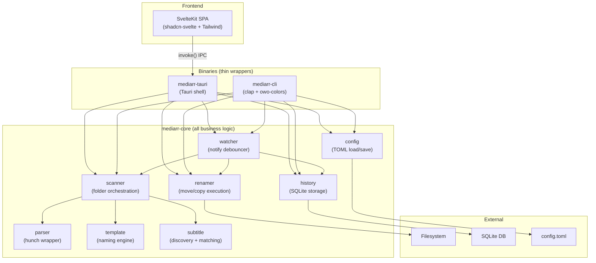

<!-- generated-by: gsd-doc-writer -->
# Architecture

## System overview

Mediarr is a cross-platform desktop and CLI application for renaming and organising media files (movies, TV series, anime). It takes a folder of release-group-named video files as input, parses their filenames to extract metadata (title, year, season, episode, resolution, codec, etc.), applies user-defined naming templates, discovers and renames associated subtitle files, and outputs a cleanly organised file structure. The system follows a **layered architecture** with a shared core library consumed by two thin binary frontends -- a Tauri desktop GUI and a `clap`-based CLI.

## Component diagram



## Data flow

A typical **scan-then-rename** operation flows through the system as follows:

1. **Entry point** -- The user triggers a scan from the GUI (Tauri `scan_folder` command via `invoke()`) or CLI (`mediarr scan /path`). Both call into `mediarr-core::Scanner`.
2. **File discovery** -- `Scanner::scan_folder` walks the target directory recursively using `walkdir`, filtering for video files by extension (mkv, mp4, avi, m4v, mov, wmv, ts, flv, webm). Files are grouped by parent directory for context-aware parsing.
3. **Filename parsing** -- For each directory group, `parser::parse_with_context` delegates to the `hunch` crate, passing sibling filenames for cross-file title detection. The raw `HunchResult` is mapped into mediarr's `MediaInfo` struct with confidence scoring and ambiguity flagging.
4. **Template rendering** -- `TemplateEngine::render` applies the user's naming template (e.g. `{title}/Season {season:02}/{title} - S{season:02}E{episode:02}.{ext}`) to the parsed `MediaInfo`, producing a proposed output path. Path components are sanitized for cross-platform compatibility.
5. **Subtitle discovery** -- `SubtitleDiscovery::discover_for_video` finds subtitle files using four strategies: sidecar matching, Subs/Subtitles subfolder scanning, nested language folder scanning, and VobSub pair detection. Each subtitle inherits its parent video's output path with language/type suffixes appended.
6. **Conflict detection** -- The scanner checks proposed output paths against existing files on disk and against other entries in the same scan batch, marking conflicts with appropriate `ScanStatus`.
7. **Plan presentation** -- Results are returned as a `Vec<ScanResult>` to the calling binary. The GUI displays them in a table with status badges; the CLI renders a formatted table or JSON output.
8. **Rename execution** -- When the user confirms, `Renamer::execute` processes the plan entry by entry. Moves use `fs_util::safe_move` which handles cross-filesystem EXDEV errors with a copy-verify-remove fallback. Copies use `std::fs::copy`. The configured `ConflictStrategy` (Skip, Overwrite, NumericSuffix) determines behavior for conflicting targets.
9. **History recording** -- Each rename batch is recorded in SQLite via `HistoryDb::record_batch`, grouped under a UUID v4 batch ID. Records include source/dest paths, parsed metadata, file size, and modification time.
10. **Undo** -- `HistoryDb::check_undo_eligible` verifies eligibility (destination files still exist, source paths are free) and `HistoryDb::execute_undo` reverses the moves.

The **watcher** flow is similar but event-driven: `WatcherManager` uses `notify-debouncer-full` to monitor a folder, bridges debounced filesystem events from notify's sync callbacks to a tokio async loop via channels, then runs the scan-rename pipeline automatically or queues entries for user review depending on the watcher's configured mode (auto/review).

## Key abstractions

| Abstraction | File | Purpose |
|---|---|---|
| `Config` | `crates/mediarr-core/src/config.rs` | Top-level application configuration (general, templates, subtitles, watchers). TOML serializable. Loaded from `dirs::config_dir()/mediarr/config.toml`. |
| `Scanner` | `crates/mediarr-core/src/scanner.rs` | Orchestrates folder scanning: file discovery, parsing, template rendering, subtitle discovery, and conflict detection. |
| `TemplateEngine` | `crates/mediarr-core/src/template.rs` | Stateless engine that renders `{variable}` templates against `MediaInfo`, with format modifiers (`:02` for zero-padding) and cross-platform path sanitization. |
| `SubtitleDiscovery` | `crates/mediarr-core/src/subtitle.rs` | Discovers subtitle files relative to a parent video using four configurable strategies. Detects language (via `isolang`) and subtitle type (forced, SDH, HI, commentary). |
| `Renamer` | `crates/mediarr-core/src/renamer.rs` | Executes rename plans with configurable operation (move/copy), conflict strategy, and directory creation. Provides both dry-run validation and actual execution. |
| `HistoryDb` | `crates/mediarr-core/src/history.rs` | SQLite-backed storage for rename history, watcher event logs, and review queue. Supports batch recording, querying, undo eligibility checking, and undo execution. |
| `WatcherManager` | `crates/mediarr-core/src/watcher.rs` | Manages filesystem watching for a folder using `notify-debouncer-full`. Bridges sync notify callbacks to tokio async runtime. Processes events via auto-rename or review-queue modes. |
| `MediError` | `crates/mediarr-core/src/error.rs` | Unified error enum using `thiserror` covering parse, template, scan, rename, history, config, I/O, subtitle, and watcher errors. |
| `MediaInfo` | `crates/mediarr-core/src/types.rs` | Parsed metadata from a media filename: title, type, year, season, episodes, resolution, codecs, source, release group, container, language, and confidence level. |
| `ScanResult` | `crates/mediarr-core/src/types.rs` | A single scan entry pairing source file, parsed metadata, proposed path, discovered subtitles, status flags, and alternative interpretations. |
| `AppState` | `crates/mediarr-tauri/src/state.rs` | Tauri-managed shared state holding the `Config`, `HistoryDb`, and active watcher handles. Wrapped in `Mutex` for thread-safe access from command handlers. |

## Directory structure rationale

```
mediarr/
├── Cargo.toml                    # Workspace root defining the three crates
├── crates/
│   ├── mediarr-core/             # ALL business logic lives here
│   │   └── src/
│   │       ├── lib.rs            # Public API re-exports
│   │       ├── config.rs         # TOML config load/save/defaults
│   │       ├── error.rs          # Unified error type (thiserror)
│   │       ├── fs_util.rs        # safe_move, path_to_utf8, video extension list
│   │       ├── history.rs        # SQLite rename history + watcher events + review queue
│   │       ├── parser.rs         # hunch wrapper -> MediaInfo mapping
│   │       ├── renamer.rs        # Move/copy execution with conflict handling
│   │       ├── scanner.rs        # Folder scan orchestration
│   │       ├── subtitle.rs       # Subtitle discovery (4 strategies)
│   │       ├── template.rs       # {variable} naming template engine
│   │       ├── types.rs          # Shared types (MediaInfo, ScanResult, etc.)
│   │       └── watcher.rs        # Filesystem watching via notify
│   ├── mediarr-cli/              # Thin CLI binary
│   │   └── src/
│   │       ├── main.rs           # clap Parser with 7 subcommands
│   │       ├── output.rs         # Table/JSON formatting for terminal
│   │       └── commands/         # One module per CLI subcommand
│   │           ├── scan.rs
│   │           ├── rename.rs
│   │           ├── history.rs
│   │           ├── undo.rs
│   │           ├── watch.rs
│   │           ├── config.rs
│   │           └── review.rs
│   └── mediarr-tauri/            # Thin Tauri desktop shell
│       ├── tauri.conf.json       # Tauri app config (window size, plugins, build)
│       └── src/
│           ├── main.rs           # Windows subsystem gate -> lib::run()
│           ├── lib.rs            # Tauri builder: plugins, state, command registration
│           ├── state.rs          # AppState (Config + HistoryDb + active watchers)
│           ├── error.rs          # CommandError -> Tauri IPC error mapping
│           └── commands/         # One module per IPC command group
│               ├── scan.rs       # scan_folder, scan_folder_streaming, scan_files
│               ├── rename.rs     # dry_run_renames, execute_renames
│               ├── history.rs    # list_batches, get_batch, check_undo_eligible, execute_undo, clear_history
│               ├── watcher.rs    # start/stop_watcher, list events/review queue, approve entries
│               └── config.rs     # get/update config, preview/validate templates
└── frontend/                     # Svelte SPA (served by Tauri webview)
    ├── package.json
    ├── svelte.config.ts
    ├── vite.config.ts
    └── src/
        ├── app.html              # HTML shell
        ├── app.css               # Tailwind v4 + OKLCH theme variables
        ├── routes/               # SvelteKit pages (SSR disabled, static adapter)
        │   ├── +layout.svelte    # Sidebar nav (Scan, Watcher, History, Settings)
        │   ├── +layout.ts        # ssr=false, prerender=false
        │   ├── scan/             # Scan page
        │   ├── watcher/          # Watcher management page
        │   ├── history/          # Rename history page
        │   └── settings/         # Settings page
        └── lib/
            ├── components/       # Svelte 5 components (runes syntax)
            │   ├── scan/         # ScanRow, FolderSelector, FilterTabs, etc.
            │   ├── watcher/      # WatcherCard, AddWatcherDialog, ActivityLog, etc.
            │   ├── history/      # BatchCard, RenameDetail
            │   ├── settings/     # GeneralSettings, TemplateEditor, SubtitlePrefs
            │   └── ui/           # shadcn-svelte primitives (button, badge, tabs, etc.)
            ├── state/            # Svelte 5 $state stores (scan, watcher, history, config, theme)
            ├── types/index.ts    # TypeScript mirrors of all Rust types for IPC
            └── utils.ts          # Shared utility functions
```

**Why this structure:**

- **mediarr-core is the single source of business logic.** Both binaries are thin wrappers. This ensures headless operation works identically to the GUI, enables testing without UI, and prevents logic duplication.
- **Each binary has its own `commands/` directory** mirroring the user-facing operations. CLI commands map 1:1 to subcommands; Tauri commands map 1:1 to IPC `invoke()` calls.
- **Frontend `types/index.ts` mirrors Rust types exactly** (snake_case field names matching serde output). This is the contract between the Rust backend and TypeScript frontend -- changes to Rust structs require corresponding TypeScript updates.
- **Frontend state uses Svelte 5 runes** (`$state`, `$derived`) in dedicated `.svelte.ts` files, keeping reactive state management separate from components.
- **shadcn-svelte `ui/` components** are copy-pasted primitives (not imported from a package) that provide the design system foundation. Domain components in `scan/`, `watcher/`, `history/`, `settings/` compose these primitives.
